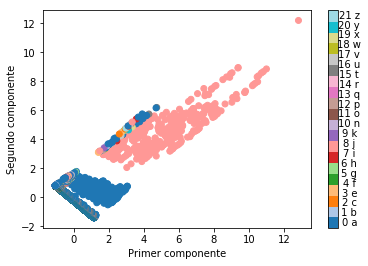
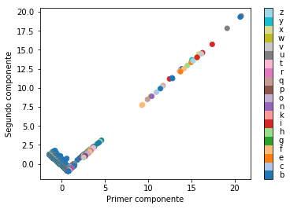
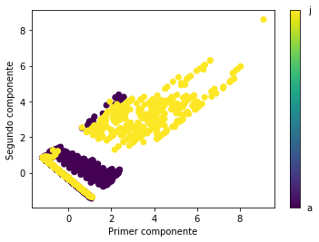

# Práctica 8
# Alberto Benavides

# Anova

Se realiza una ANOVA para ver las interacciones entre los casos normalizados y las semanas con las CIEs


```python
from statsmodels.formula.api import ols

m = ols('cie ~ casos + sem', data = features).fit() 
a = sm.stats.anova_lm(m, typ = 2)
print(a)
n = len(a)
alpha = 0.05
for i in range(n):
    print("{:s} {:s}es significativo".format(a.index[i], "" if a['PR(>F)'][i] < alpha else "no "))
```

                    sum_sq       df          F    PR(>F)
    casos     9.609452e+02      1.0  22.552909  0.000002
    sem       6.349658e+02      1.0  14.902334  0.000114
    Residual  1.001768e+06  23511.0        NaN       NaN
    casos es significativo
    sem es significativo
    Residual no es significativo
    

Las interacciones son estadísticamente significativas, pero los residuales son muy grandes. También, la suma de cuadrados para los casos y las semanas es similar, por lo que sus varianzas son cercanas, lo que ya se había constatado al estudiar su correlación.

# PCA

Ahora se realiza un análisis de componentes principales o PCA por sus siglas en inglés a partir de las características


```python
from sklearn.decomposition import PCA
from sklearn.preprocessing import StandardScaler

x = features[['casos', 'sem']].values
x = StandardScaler().fit_transform(x)
y = features.loc[:,['cie']].values
k = 2 # dimensiones deseadas
pca = PCA(n_components = k)
cd = pd.DataFrame(data = pca.fit_transform(x), columns = ['pca{:d}'.format(i) for i in range(k)])
cd['cie'] = y
ordenado = pd.DataFrame.sort_values(cd, ['cie'], ascending = False)
cd.sample(3)
```


<div>
<style scoped>
    .dataframe tbody tr th:only-of-type {
        vertical-align: middle;
    }

    .dataframe tbody tr th {
        vertical-align: top;
    }

    .dataframe thead th {
        text-align: right;
    }
</style>
<table border="1" class="dataframe">
  <thead>
    <tr style="text-align: right;">
      <th></th>
      <th>pca0</th>
      <th>pca1</th>
      <th>cie</th>
    </tr>
  </thead>
  <tbody>
    <tr>
      <th>11759</th>
      <td>7.427456</td>
      <td>7.499567</td>
      <td>8.0</td>
    </tr>
    <tr>
      <th>15772</th>
      <td>-0.670430</td>
      <td>0.439099</td>
      <td>18.0</td>
    </tr>
    <tr>
      <th>4183</th>
      <td>0.691771</td>
      <td>-0.953808</td>
      <td>0.0</td>
    </tr>
  </tbody>
</table>
</div>


```python
pca.explained_variance_ratio_
```


    array([0.53307324, 0.46692676])


Estos componentes principales comparten de manera muy cercana la mitad de la varianza de los datos.


```python
import matplotlib.cm as cm

plt.figure()
plt.xlabel('Primer componente')
plt.ylabel('Segundo componente')
plt.scatter(cd.pca0, cd.pca1, c = cd.cie, cmap=cm.tab20)

cbar = plt.colorbar()
cbar.ax.get_yaxis().set_ticks([])
for j, lab in enumerate(cieName):
    cbar.ax.text(2, (j + 0.5) / len(cieName), str(j) + ' ' +lab, ha='center', va='center')
cbar.ax.get_yaxis().labelpad = 15
plt.show()
```





Estos resultados muestran una clara distinción entre las CIE A y J, por lo que podrían apartarse del conjunto y ver cómo se comportan el resto


```python
features_copy = features

features_copy = features_copy[features_copy['cie'] != 0]
features_copy = features_copy[features_copy['cie'] != 8]

x = features_copy[['casos', 'sem']].values
x = StandardScaler().fit_transform(x)
y = features_copy.loc[:,['cie']].values
k = 2 # dimensiones deseadas
pca = PCA(n_components = k)
cd = pd.DataFrame(data = pca.fit_transform(x), columns = ['pca{:d}'.format(i) for i in range(k)])
cd['cie'] = y
ordenado = pd.DataFrame.sort_values(cd, ['cie'], ascending = False)

plt.figure()
plt.xlabel('Primer componente')
plt.ylabel('Segundo componente')
plt.scatter(cd.pca0, cd.pca1, c = cd.cie, cmap=cm.tab20)

cieName_copy = cieName
cieName_copy.remove('a')
cieName_copy.remove('j')

cbar = plt.colorbar()
cbar.ax.get_yaxis().set_ticks([])
for j, lab in enumerate(cieName_copy):
    cbar.ax.text(2, (j + 0.5) / len(cieName_copy), lab, ha='center', va='center')
cbar.ax.get_yaxis().labelpad = 15
plt.show()
```





Después de la eliminación, el resto de las CIE parecen seguir patrones impredecibles con base en estas características. En cambio, puede suponerse que entre las A y las J hay una clara distinción y probablemente se puedan obtener mejores modelos si se descartan las demás CIE.


```python
features_copy = pd.concat([features[features.cie == 0], features[features.cie == 8]])

x = features_copy[['casos', 'sem']].values
x = StandardScaler().fit_transform(x)
y = features_copy.loc[:,['cie']].values
k = 2 # dimensiones deseadas
pca = PCA(n_components = k)
cd = pd.DataFrame(data = pca.fit_transform(x), columns = ['pca{:d}'.format(i) for i in range(k)])
cd['cie'] = y
ordenado = pd.DataFrame.sort_values(cd, ['cie'], ascending = False)

plt.figure()
plt.xlabel('Primer componente')
plt.ylabel('Segundo componente')
plt.scatter(cd.pca0, cd.pca1, c = cd.cie)

cieName_copy = ['a', 'j']

cbar = plt.colorbar()
cbar.ax.get_yaxis().set_ticks([])
for j, lab in enumerate(cieName_copy):
    cbar.ax.text(2, (j), lab, ha='center', va='center')
cbar.ax.get_yaxis().labelpad = 15
plt.show()
```





```python
m = ols('cie ~ casos + sem', data = features_copy).fit() 
a = sm.stats.anova_lm(m, typ = 2)
print(a)
n = len(a)
alpha = 0.05
for i in range(n):
    print("{:s} {:s}es significativo".format(a.index[i], "" if a['PR(>F)'][i] < alpha else "no "))
```

                    sum_sq       df            F        PR(>F)
    casos     14906.513429      1.0  3023.303363  0.000000e+00
    sem         505.752055      1.0   102.575421  5.266110e-24
    Residual  55315.710699  11219.0          NaN           NaN
    casos es significativo
    sem es significativo
    Residual no es significativo
    


```python
(1.001768e+06 - 55560.613600) / 1.001768e+06
```


    0.9445374441986567


La suma cuadrada de los residuales se redujo un 94% pero aún así siguen siendo altos, por lo que con estas características parece improbable ajustar un modelo.