# Series de tiempo

De entre las series de tiempo para cada enfermedad en el periodo descrito, no todas contienen información de casos reportados durante el periodo de tiempo establecido para la investigación, por lo que se extraen los que reportan al menos la mitad del periodo (260 semanas)


```python
# https://stackoverflow.com/a/16916611
print('Iniciales {}'.format(len(cie))) 
cie = cie.filter(lambda x: x['sem'].count() >= 260 )
cie.reset_index(drop=True, inplace=True)
cie = cie.groupby('cie')
print('Restantes {}'.format(len(cie)))
```

    Iniciales 138
    Restantes 40
    


```python
print('Iniciales {}'.format(len(cieG))) 
cieG = cieG.filter(lambda x: x['sem'].count() >= 260 )
cieG.reset_index(drop=True, inplace=True)
cieG = cieG.groupby(cieG.cie.str[0])
print('Restantes {}'.format(len(cieG)))
```

    Iniciales 22
    Restantes 12
    

Así, de 138 series de tiempo de enfermedades, se obtienen 40 en las que al menos se cuenta con datos semanales de 5 años. Para dichas enfermedades se obtienen los pesos de la regresión lineal y se obtiene la serie de tiempo sin la tendencia y las autocorrelaciones (eliminando la a92.3 porque viene vacía)


```python
from scipy import signal
from statsmodels.graphics.tsaplots import plot_pacf, plot_acf
from statsmodels.tsa.stattools import acf

ciesF = [] # CIEs Características
ciesTSt = [] # CIEs Series de tiempo

for name, group in cie:
    if name == 'a92.3':
        continue
    
    # https://docs.scipy.org/doc/scipy/reference/generated/scipy.signal.detrend.html
    detrended = signal.detrend(group.casos)
    
    a, b, r, p, e = stats.linregress(group['sem'], group.casos)
    print("y = f(x) = {} x + {}".format(a, b))
    print("error", e)
    print("p = ", p)
    print("pendiente {:s}significativa".format("no " if p >= 0.05 else ""))
    print("R^2", r**2)
    plt.figure(figsize=(12, 2))
    plt.plot(group['sem'], group.casos)
    plt.plot(group['sem'], detrended, c='black')
    plt.plot(group['sem'], (a * group['sem'] + b), label = 'y = {:.1f}x + {:.0f}'.format(a, b), color = 'red', linewidth = 3)
    plt.title(name)
    plt.xlabel("Semana")
    plt.ylabel("Casos normalizados")
    plt.show()
    
    # https://stackoverflow.com/questions/48497756/time-series-distance-metric
    plt.figure(figsize=(12, 2))
    # https://pandas.pydata.org/pandas-docs/stable/reference/api/pandas.Series.cumsum.html
    plt.plot(group['sem'], group.casos.cumsum(), c='green')
    plt.title(name)
    plt.xlabel("Semana")
    plt.ylabel("Acumulado de Casos normalizados")
    plt.show()
    
    # https://machinelearningmastery.com/gentle-introduction-autocorrelation-partial-autocorrelation/
    plot_acf(detrended, lags=52)
    # https://www.statsmodels.org/dev/generated/statsmodels.tsa.stattools.acf.html
    plt.title(name)
    plt.xlabel("Retraso en semanas")
    plt.ylabel('Correlación')
    plt.show()
    
    temp = [a, b]
    # https://stackoverflow.com/a/3748071
    temp.extend(acf(detrended, nlags=52))
    temp.append(name)
    ciesF.append(temp)
    
    temp2 = list(group.casos)
    #temp2.append(name)
    ciesTSt.append(temp2)

```

    y = f(x) = 4.2687498879775535e-11 x + -5.61276490864389e-09
    error 2.0113605583063735e-11
    p =  0.03438325581830106
    pendiente significativa
    R^2 0.010390302941758996
    


    y = f(x) = -1.7653075450894884e-06 x + 0.0019754909758688734
    error 1.215881678974069e-07
    p =  1.0774404716157897e-37
    pendiente significativa
    R^2 0.3765563116502911
    


    y = f(x) = -3.0752338979568535e-09 x + 1.2904965711605356e-05
    error 8.36749265385657e-10
    p =  0.0002687345236732541
    pendiente significativa
    R^2 0.03144815483703095
    


    y = f(x) = -1.0785666679174943e-08 x + 6.155839207125693e-06
    error 3.564598970127455e-10
    p =  3.9269145731807006e-112
    pendiente significativa
    R^2 0.6622135065357393
    


    y = f(x) = -9.213574424729245e-09 x + 1.2957954379028175e-05
    error 6.75300549213463e-10
    p =  4.863591366039641e-36
    pendiente significativa
    R^2 0.2798612445705242
    


    y = f(x) = -3.831012274635742e-09 x + 4.559110665311131e-06
    error 2.056660576324692e-10
    p =  2.1083769747172313e-58
    pendiente significativa
    R^2 0.4247090552255535
    


    y = f(x) = -1.4627725963638185e-11 x + 4.5153183905681134e-08
    error 8.6165080095987e-12
    p =  0.09023493838847157
    pendiente no significativa
    R^2 0.006068835261027791
    


    y = f(x) = -1.7642681104091792e-10 x + 6.894953499860091e-07
    error 6.403728082254567e-11
    p =  0.0061121040534305735
    pendiente significativa
    R^2 0.01699628644380042
    


    y = f(x) = 3.8938781393720075e-11 x + 4.4324399670136904e-08
    error 2.301537019363991e-11
    p =  0.09131901816285937
    pendiente no significativa
    R^2 0.00590350974760678
    


    y = f(x) = 2.3434709729609935e-13 x + -3.6003147872535345e-11
    error 1.478629682740248e-13
    p =  0.1136746875979033
    pendiente no significativa
    R^2 0.005407586602284264
    


    y = f(x) = -3.4234098194666664e-11 x + 1.8622107713377432e-08
    error 7.415007265413988e-12
    p =  4.945787391949576e-06
    pendiente significativa
    R^2 0.040422588588555235
    


    y = f(x) = 2.725400812299939e-10 x + 1.9471946148640167e-08
    error 7.110945660238779e-11
    p =  0.00014458146666075644
    pendiente significativa
    R^2 0.031274848966871695
    


    y = f(x) = -4.255464112013022e-09 x + 2.7470903702510135e-06
    error 3.3548559373967543e-10
    p =  6.366969283108536e-32
    pendiente significativa
    R^2 0.25462455709847065
    


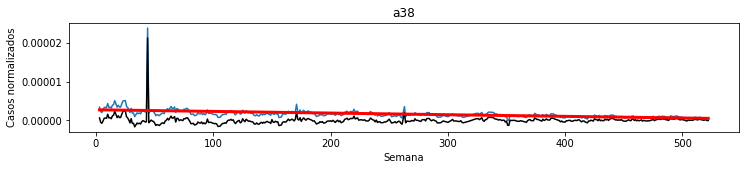


    y = f(x) = -1.0744562226275755e-10 x + 5.3269706349552e-08
    error 6.010845348981309e-11
    p =  0.07452781641973526
    pendiente no significativa
    R^2 0.007081769917450651
    


    y = f(x) = -4.51442956629053e-11 x + 5.003109663849265e-08
    error 8.825884482273087e-12
    p =  4.625709147491021e-07
    pendiente significativa
    R^2 0.05414963353204715
    


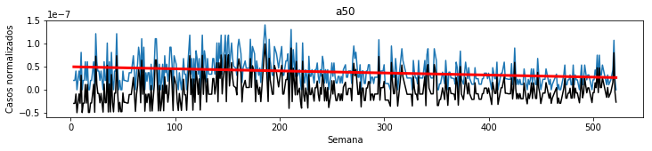


    y = f(x) = -2.8757621426513095e-09 x + 8.65805695809489e-06
    error 2.5195362618720955e-09
    p =  0.25425697912167106
    pendiente no significativa
    R^2 0.002603944949826924
    


    y = f(x) = -1.4644681914017878e-07 x + 0.00011211051217541277
    error 1.1228826202874234e-08
    p =  2.0750705342062423e-33
    pendiente significativa
    R^2 0.2653193213169377
    


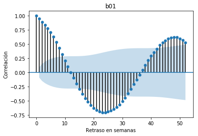


    y = f(x) = -2.722125710622442e-10 x + 1.262294141156984e-07
    error 1.588658069624221e-11
    p =  7.30165010543899e-51
    pendiente significativa
    R^2 0.3985877970692943
    


    y = f(x) = -7.433434732564669e-09 x + 6.901511580636186e-06
    error 4.809110869935852e-10
    p =  3.1523565347787724e-42
    pendiente significativa
    R^2 0.3841635208468614
    


    y = f(x) = -1.2411343091809244e-10 x + 2.1160165305354125e-07
    error 2.468137006599137e-11
    p =  7.217507598355145e-07
    pendiente significativa
    R^2 0.05458192227303572
    


    y = f(x) = 4.306189172696877e-11 x + 4.5311776302657916e-07
    error 4.983732447188263e-11
    p =  0.3880813876059074
    pendiente no significativa
    R^2 0.0018723188046217538
    


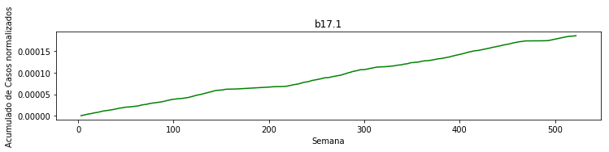


    y = f(x) = -9.851452950958728e-10 x + 1.4372871687382767e-06
    error 2.0422528814979408e-10
    p =  2.004159852045715e-06
    pendiente significativa
    R^2 0.05484537751521497
    


    y = f(x) = -4.5977874526241305e-09 x + 2.970356116391645e-06
    error 1.2200834000344058e-10
    p =  5.731116914266081e-137
    pendiente significativa
    R^2 0.7713322815069262
    


    y = f(x) = -3.141197049928086e-08 x + 0.00011159382796415527
    error 1.555599789385595e-08
    p =  0.04432369209037648
    pendiente significativa
    R^2 0.013065683803978847
    


    y = f(x) = -1.0673850709576887e-11 x + 4.355250762325799e-09
    error 3.1880871555405942e-12
    p =  0.0008764994132686745
    pendiente significativa
    R^2 0.02236467960180641
    


    y = f(x) = -1.1834633525276088e-09 x + 7.100912129285122e-07
    error 9.393463801467669e-11
    p =  1.2559331815198554e-31
    pendiente significativa
    R^2 0.24928894104283042
    


    y = f(x) = -2.6544241562890327e-10 x + 3.2049521522763566e-07
    error 3.7319118941308474e-11
    p =  4.610321182741757e-12
    pendiente significativa
    R^2 0.10270484494415096
    


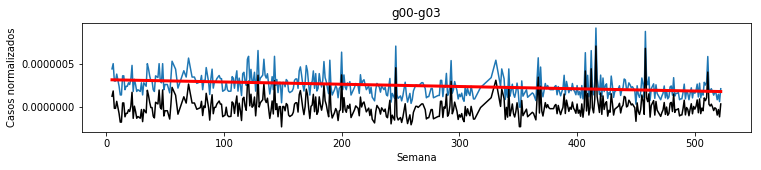


    y = f(x) = -4.556172046800565e-10 x + 3.7500114147077754e-07
    error 3.423510008372152e-11
    p =  1.8548314561638924e-34
    pendiente significativa
    R^2 0.27626166419878756
    


    y = f(x) = -6.932314608726674e-06 x + 0.008805967823835786
    error 6.162044690299544e-07
    p =  7.503334430143699e-26
    pendiente significativa
    R^2 0.23113873276962404
    


    y = f(x) = -4.3876585629436324e-08 x + 5.08928603405923e-05
    error 4.181979380800392e-09
    p =  2.3727736779313174e-23
    pendiente significativa
    R^2 0.1846709286259034
    


    y = f(x) = 3.0607452607643954e-14 x + 8.632235917582137e-10
    error 1.081125720208934e-12
    p =  0.977427221531179
    pendiente no significativa
    R^2 1.8298987789071008e-06
    


    y = f(x) = -7.142618310354189e-10 x + 1.178302593061399e-06
    error 1.457944295445013e-10
    p =  1.332329783777257e-06
    pendiente significativa
    R^2 0.04918267323938655
    


    y = f(x) = -1.3158987800860395e-08 x + 1.643445025799908e-05
    error 1.6084785128648306e-09
    p =  1.0885896084621633e-14
    pendiente significativa
    R^2 0.19747207526346663
    


    y = f(x) = -5.001283641779608e-08 x + 8.79623291848092e-05
    error 5.714736801137942e-09
    p =  3.9731738436330694e-17
    pendiente significativa
    R^2 0.14220420601744926
    


    y = f(x) = -8.130421944150189e-10 x + 1.4827816461880552e-06
    error 5.134961166576471e-10
    p =  0.11399979312553642
    pendiente no significativa
    R^2 0.005185003922499099
    


    y = f(x) = -2.3438815029578847e-11 x + 1.5962437413039917e-07
    error 5.628337741371575e-11
    p =  0.6772793134611802
    pendiente no significativa
    R^2 0.00037523732655554817
    


    y = f(x) = -5.193298199318447e-08 x + 4.533358442590547e-05
    error 1.6692637054937939e-09
    p =  1.6078008523125964e-114
    pendiente significativa
    R^2 0.6811910446622308
    


    y = f(x) = -9.132331371853938e-10 x + 1.3202325787207294e-06
    error 1.431149104840528e-10
    p =  4.359158383428425e-10
    pendiente significativa
    R^2 0.08264080526994147
    


    y = f(x) = 3.638834463785146e-10 x + 1.1174278631513553e-06
    error 1.1201987356227443e-10
    p =  0.001257639893824037
    pendiente significativa
    R^2 0.025453964627936122
    


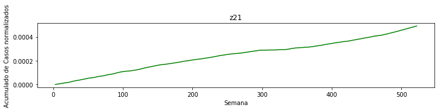


```python
for name, group in cieG:
    
    # https://docs.scipy.org/doc/scipy/reference/generated/scipy.signal.detrend.html
    detrended = signal.detrend(group.casos)
    
    a, b, r, p, e = stats.linregress(group['sem'], group.casos)
    print("y = f(x) = {} x + {}".format(a, b))
    print("error", e)
    print("p = ", p)
    print("pendiente {:s}significativa".format("no " if p >= 0.05 else ""))
    print("R^2", r**2)
    plt.figure(figsize=(12, 2))
    plt.plot(group['sem'], group.casos)
    plt.plot(group['sem'], detrended, c='black')
    plt.plot(group['sem'], (a * group['sem'] + b), label = 'y = {:.1f}x + {:.0f}'.format(a, b), color = 'red', linewidth = 3)
    plt.title(name)
    plt.xlabel("Semana")
    plt.ylabel("Casos normalizados")
    plt.show()
    
    # https://stackoverflow.com/questions/48497756/time-series-distance-metric
    plt.figure(figsize=(12, 2))
    # https://pandas.pydata.org/pandas-docs/stable/reference/api/pandas.Series.cumsum.html
    plt.plot(group['sem'], group.casos.cumsum(), c='green')
    plt.title(name)
    plt.xlabel("Semana")
    plt.ylabel("Acumulado de Casos normalizados")
    plt.show()
    
    plt.figure()
    # https://machinelearningmastery.com/gentle-introduction-autocorrelation-partial-autocorrelation/
    plot_acf(detrended, lags=52)
    # https://www.statsmodels.org/dev/generated/statsmodels.tsa.stattools.acf.html
    plt.title(name)
    plt.xlabel("Retraso en semanas")
    plt.ylabel('Correlación')
    plt.show()
```

    y = f(x) = -2.3224356070873255e-07 x + 0.00018642953885186607
    error 2.458069138569354e-08
    p =  4.2189376399252386e-21
    pendiente significativa
    R^2 0.008834750473414046
    


    <Figure size 432x288 with 0 Axes>


    y = f(x) = -1.9503026794867653e-08 x + 2.1003475197080275e-05
    error 2.9914826904487065e-09
    p =  7.747452841909533e-11
    pendiente significativa
    R^2 0.008415817644051377
    


    <Figure size 432x288 with 0 Axes>


    y = f(x) = -7.687412126573934e-08 x + 6.301895314999713e-05
    error 1.1457310486128478e-07
    p =  0.5026730466383222
    pendiente no significativa
    R^2 0.0012420716051614582
    


    <Figure size 432x288 with 0 Axes>


    y = f(x) = 4.324626671299835e-10 x + 2.04941342972253e-07
    error 7.239655510808932e-11
    p =  4.1887790791163235e-09
    pendiente significativa
    R^2 0.06134442012808605
    


    <Figure size 432x288 with 0 Axes>


    y = f(x) = 6.114012516943938e-08 x + -9.37021948204884e-06
    error 5.454249521195378e-09
    p =  7.943541732517958e-27
    pendiente significativa
    R^2 0.1593291079485521
    


    <Figure size 432x288 with 0 Axes>


    y = f(x) = -5.4762876304630354e-06 x + 0.004047543918036931
    error 6.313606290646645e-07
    p =  1.2891385768087959e-17
    pendiente significativa
    R^2 0.057202405083796086
    


    <Figure size 432x288 with 0 Axes>


    y = f(x) = 3.0607452607643954e-14 x + 8.632235917582137e-10
    error 1.081125720208934e-12
    p =  0.977427221531179
    pendiente no significativa
    R^2 1.8298987789071008e-06
    


    <Figure size 432x288 with 0 Axes>


    y = f(x) = -4.552145867367468e-08 x + 4.150055938885172e-05
    error 5.28039387715845e-09
    p =  1.7027198403366345e-17
    pendiente significativa
    R^2 0.04850098103773122
    


    <Figure size 432x288 with 0 Axes>


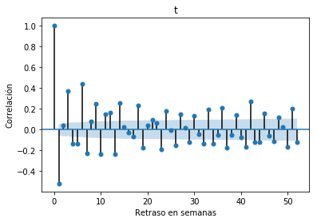


    y = f(x) = -5.496981234999186e-10 x + 8.572895488021172e-07
    error 2.657552949170129e-10
    p =  0.038856309457124164
    pendiente significativa
    R^2 0.004272969521096534
    


    <Figure size 432x288 with 0 Axes>


    y = f(x) = -3.11383856620073e-08 x + 3.0350821580836582e-05
    error 3.4613396780786333e-09
    p =  2.313921331364859e-18
    pendiente significativa
    R^2 0.10649538120403663
    


    <Figure size 432x288 with 0 Axes>


    y = f(x) = -9.132331371853938e-10 x + 1.3202325787207294e-06
    error 1.431149104840528e-10
    p =  4.359158383428425e-10
    pendiente significativa
    R^2 0.08264080526994147
    


    <Figure size 432x288 with 0 Axes>


    y = f(x) = 3.638834463785146e-10 x + 1.1174278631513553e-06
    error 1.1201987356227443e-10
    p =  0.001257639893824037
    pendiente significativa
    R^2 0.025453964627936122
    


    <Figure size 432x288 with 0 Axes>


Se extraen las características de cada CIE en tanto serie de tiempo. A saber, su pendiente, ordenada en el origen y las autocorrelaciones con retraso de 1 a 52 semanas (eliminando el retraso de 0 semanas)


```python
ciesF = pd.DataFrame(ciesF)

# https://stackoverflow.com/a/11346337
colNames = ['m', 'b']
for i in range (53):
    colNames.append('ac' + str(i))
colNames.append('cie')
ciesF.columns = colNames

ciesF = ciesF.drop(['ac0'], axis=1)

ciesF.sort_values(by=['m'], ascending=False)
```


<div>
<style scoped>
    .dataframe tbody tr th:only-of-type {
        vertical-align: middle;
    }

    .dataframe tbody tr th {
        vertical-align: top;
    }

    .dataframe thead th {
        text-align: right;
    }
</style>
<table border="1" class="dataframe">
  <thead>
    <tr style="text-align: right;">
      <th></th>
      <th>m</th>
      <th>b</th>
      <th>ac1</th>
      <th>ac2</th>
      <th>ac3</th>
      <th>ac4</th>
      <th>ac5</th>
      <th>ac6</th>
      <th>ac7</th>
      <th>ac8</th>
      <th>...</th>
      <th>ac44</th>
      <th>ac45</th>
      <th>ac46</th>
      <th>ac47</th>
      <th>ac48</th>
      <th>ac49</th>
      <th>ac50</th>
      <th>ac51</th>
      <th>ac52</th>
      <th>cie</th>
    </tr>
  </thead>
  <tbody>
    <tr>
      <th>38</th>
      <td>3.638834e-10</td>
      <td>1.117428e-06</td>
      <td>0.497210</td>
      <td>0.371337</td>
      <td>0.338770</td>
      <td>0.295026</td>
      <td>0.246889</td>
      <td>0.170797</td>
      <td>0.177532</td>
      <td>0.174927</td>
      <td>...</td>
      <td>0.095734</td>
      <td>0.079953</td>
      <td>0.094433</td>
      <td>0.045073</td>
      <td>0.020609</td>
      <td>0.002565</td>
      <td>-0.025604</td>
      <td>0.001100</td>
      <td>0.014393</td>
      <td>z21</td>
    </tr>
    <tr>
      <th>11</th>
      <td>2.725401e-10</td>
      <td>1.947195e-08</td>
      <td>0.089659</td>
      <td>-0.019229</td>
      <td>-0.025867</td>
      <td>-0.002608</td>
      <td>-0.028985</td>
      <td>-0.001130</td>
      <td>-0.058919</td>
      <td>-0.019433</td>
      <td>...</td>
      <td>-0.034949</td>
      <td>-0.062431</td>
      <td>-0.002219</td>
      <td>0.029734</td>
      <td>0.005434</td>
      <td>-0.050439</td>
      <td>0.078625</td>
      <td>0.029168</td>
      <td>-0.002898</td>
      <td>a37</td>
    </tr>
    <tr>
      <th>20</th>
      <td>4.306189e-11</td>
      <td>4.531178e-07</td>
      <td>0.299805</td>
      <td>0.225857</td>
      <td>0.068495</td>
      <td>0.057942</td>
      <td>0.001655</td>
      <td>0.017533</td>
      <td>0.033656</td>
      <td>0.100137</td>
      <td>...</td>
      <td>0.050684</td>
      <td>0.016318</td>
      <td>0.061034</td>
      <td>0.053793</td>
      <td>0.021663</td>
      <td>0.059753</td>
      <td>-0.005982</td>
      <td>0.033164</td>
      <td>-0.047455</td>
      <td>b17.1</td>
    </tr>
    <tr>
      <th>0</th>
      <td>4.268750e-11</td>
      <td>-5.612765e-09</td>
      <td>0.393749</td>
      <td>0.122484</td>
      <td>0.010328</td>
      <td>0.026661</td>
      <td>0.015698</td>
      <td>0.021141</td>
      <td>-0.002905</td>
      <td>-0.010120</td>
      <td>...</td>
      <td>-0.017536</td>
      <td>-0.017607</td>
      <td>-0.017679</td>
      <td>-0.017751</td>
      <td>-0.017822</td>
      <td>-0.017893</td>
      <td>-0.017965</td>
      <td>-0.018036</td>
      <td>-0.018107</td>
      <td>a00</td>
    </tr>
    <tr>
      <th>8</th>
      <td>3.893878e-11</td>
      <td>4.432440e-08</td>
      <td>0.393243</td>
      <td>0.260146</td>
      <td>0.044702</td>
      <td>0.032172</td>
      <td>0.012605</td>
      <td>0.025166</td>
      <td>0.014480</td>
      <td>0.009281</td>
      <td>...</td>
      <td>-0.017366</td>
      <td>0.067969</td>
      <td>0.005142</td>
      <td>0.003701</td>
      <td>-0.020010</td>
      <td>0.007456</td>
      <td>0.042142</td>
      <td>0.077540</td>
      <td>0.090818</td>
      <td>a27</td>
    </tr>
    <tr>
      <th>9</th>
      <td>2.343471e-13</td>
      <td>-3.600315e-11</td>
      <td>-0.007522</td>
      <td>-0.007561</td>
      <td>-0.007600</td>
      <td>-0.007639</td>
      <td>-0.007678</td>
      <td>-0.007717</td>
      <td>-0.007756</td>
      <td>-0.007795</td>
      <td>...</td>
      <td>-0.000592</td>
      <td>-0.000605</td>
      <td>-0.000618</td>
      <td>-0.000631</td>
      <td>-0.000644</td>
      <td>-0.000657</td>
      <td>-0.000670</td>
      <td>-0.000683</td>
      <td>-0.000696</td>
      <td>a33</td>
    </tr>
    <tr>
      <th>30</th>
      <td>3.060745e-14</td>
      <td>8.632236e-10</td>
      <td>0.055952</td>
      <td>0.062823</td>
      <td>0.076371</td>
      <td>0.006623</td>
      <td>0.030863</td>
      <td>-0.037294</td>
      <td>-0.060305</td>
      <td>0.059805</td>
      <td>...</td>
      <td>-0.057127</td>
      <td>-0.057262</td>
      <td>-0.035717</td>
      <td>-0.035852</td>
      <td>-0.057666</td>
      <td>-0.057801</td>
      <td>-0.057936</td>
      <td>-0.058070</td>
      <td>-0.058205</td>
      <td>p35.0</td>
    </tr>
    <tr>
      <th>24</th>
      <td>-1.067385e-11</td>
      <td>4.355251e-09</td>
      <td>0.077117</td>
      <td>0.322187</td>
      <td>0.046591</td>
      <td>0.036037</td>
      <td>-0.023600</td>
      <td>0.020128</td>
      <td>-0.018800</td>
      <td>-0.026529</td>
      <td>...</td>
      <td>-0.023442</td>
      <td>0.017590</td>
      <td>-0.018073</td>
      <td>-0.018183</td>
      <td>-0.023882</td>
      <td>0.032515</td>
      <td>-0.001876</td>
      <td>0.011733</td>
      <td>0.004771</td>
      <td>b50</td>
    </tr>
    <tr>
      <th>6</th>
      <td>-1.462773e-11</td>
      <td>4.515318e-08</td>
      <td>0.085993</td>
      <td>0.048897</td>
      <td>0.064574</td>
      <td>0.118768</td>
      <td>-0.023565</td>
      <td>-0.026439</td>
      <td>0.023959</td>
      <td>-0.036252</td>
      <td>...</td>
      <td>0.064103</td>
      <td>0.019108</td>
      <td>-0.021642</td>
      <td>-0.019077</td>
      <td>0.015544</td>
      <td>0.031099</td>
      <td>-0.056185</td>
      <td>-0.073401</td>
      <td>-0.004459</td>
      <td>a17.0</td>
    </tr>
    <tr>
      <th>35</th>
      <td>-2.343882e-11</td>
      <td>1.596244e-07</td>
      <td>0.550097</td>
      <td>0.512561</td>
      <td>0.454005</td>
      <td>0.411662</td>
      <td>0.363330</td>
      <td>0.254477</td>
      <td>0.225435</td>
      <td>0.181761</td>
      <td>...</td>
      <td>-0.032387</td>
      <td>-0.007867</td>
      <td>0.004137</td>
      <td>-0.020714</td>
      <td>0.015187</td>
      <td>-0.003246</td>
      <td>0.008389</td>
      <td>0.020997</td>
      <td>0.018492</td>
      <td>u98</td>
    </tr>
    <tr>
      <th>10</th>
      <td>-3.423410e-11</td>
      <td>1.862211e-08</td>
      <td>-0.081445</td>
      <td>0.057375</td>
      <td>-0.049496</td>
      <td>0.012841</td>
      <td>0.056102</td>
      <td>-0.020204</td>
      <td>-0.009801</td>
      <td>-0.032175</td>
      <td>...</td>
      <td>-0.005745</td>
      <td>0.005151</td>
      <td>-0.043027</td>
      <td>0.056617</td>
      <td>-0.031916</td>
      <td>0.114628</td>
      <td>-0.035333</td>
      <td>0.052850</td>
      <td>-0.016788</td>
      <td>a34</td>
    </tr>
    <tr>
      <th>14</th>
      <td>-4.514430e-11</td>
      <td>5.003110e-08</td>
      <td>0.076912</td>
      <td>0.149122</td>
      <td>0.088945</td>
      <td>0.072881</td>
      <td>0.114257</td>
      <td>0.074084</td>
      <td>0.108017</td>
      <td>0.108573</td>
      <td>...</td>
      <td>0.036326</td>
      <td>0.015114</td>
      <td>0.051616</td>
      <td>0.032731</td>
      <td>-0.039804</td>
      <td>0.002215</td>
      <td>0.025619</td>
      <td>0.016111</td>
      <td>-0.024214</td>
      <td>a50</td>
    </tr>
    <tr>
      <th>13</th>
      <td>-1.074456e-10</td>
      <td>5.326971e-08</td>
      <td>0.003941</td>
      <td>-0.012528</td>
      <td>-0.008077</td>
      <td>-0.013007</td>
      <td>-0.007537</td>
      <td>-0.016467</td>
      <td>0.003030</td>
      <td>-0.001938</td>
      <td>...</td>
      <td>-0.011364</td>
      <td>-0.003043</td>
      <td>-0.003882</td>
      <td>0.012084</td>
      <td>0.000458</td>
      <td>-0.001701</td>
      <td>0.007212</td>
      <td>-0.004964</td>
      <td>-0.004440</td>
      <td>a39.0</td>
    </tr>
    <tr>
      <th>19</th>
      <td>-1.241134e-10</td>
      <td>2.116017e-07</td>
      <td>0.289203</td>
      <td>0.226359</td>
      <td>0.276856</td>
      <td>0.274657</td>
      <td>0.253692</td>
      <td>0.247411</td>
      <td>0.247509</td>
      <td>0.206441</td>
      <td>...</td>
      <td>0.021663</td>
      <td>0.093129</td>
      <td>0.023837</td>
      <td>0.146601</td>
      <td>0.018644</td>
      <td>0.036760</td>
      <td>0.043459</td>
      <td>-0.015475</td>
      <td>-0.004356</td>
      <td>b16</td>
    </tr>
    <tr>
      <th>7</th>
      <td>-1.764268e-10</td>
      <td>6.894953e-07</td>
      <td>0.522652</td>
      <td>0.363609</td>
      <td>0.361372</td>
      <td>0.385651</td>
      <td>0.326709</td>
      <td>0.325553</td>
      <td>0.318398</td>
      <td>0.252245</td>
      <td>...</td>
      <td>0.196099</td>
      <td>0.182101</td>
      <td>0.163183</td>
      <td>0.167669</td>
      <td>0.235813</td>
      <td>0.206676</td>
      <td>0.215066</td>
      <td>0.167751</td>
      <td>0.183912</td>
      <td>a23</td>
    </tr>
    <tr>
      <th>26</th>
      <td>-2.654424e-10</td>
      <td>3.204952e-07</td>
      <td>0.110847</td>
      <td>0.069672</td>
      <td>0.107836</td>
      <td>0.080559</td>
      <td>0.128797</td>
      <td>-0.027006</td>
      <td>0.042914</td>
      <td>-0.009807</td>
      <td>...</td>
      <td>0.029668</td>
      <td>0.076565</td>
      <td>0.089312</td>
      <td>0.024519</td>
      <td>0.008848</td>
      <td>0.059614</td>
      <td>0.099755</td>
      <td>0.046717</td>
      <td>-0.020862</td>
      <td>g00-g03</td>
    </tr>
    <tr>
      <th>17</th>
      <td>-2.722126e-10</td>
      <td>1.262294e-07</td>
      <td>0.488103</td>
      <td>0.474707</td>
      <td>0.426456</td>
      <td>0.414057</td>
      <td>0.317635</td>
      <td>0.304248</td>
      <td>0.261418</td>
      <td>0.248762</td>
      <td>...</td>
      <td>0.072010</td>
      <td>0.087184</td>
      <td>0.117220</td>
      <td>0.163608</td>
      <td>0.087383</td>
      <td>0.129308</td>
      <td>0.128205</td>
      <td>0.131949</td>
      <td>0.139945</td>
      <td>b06</td>
    </tr>
    <tr>
      <th>27</th>
      <td>-4.556172e-10</td>
      <td>3.750011e-07</td>
      <td>0.232941</td>
      <td>0.165279</td>
      <td>0.155966</td>
      <td>0.155952</td>
      <td>0.159776</td>
      <td>0.110074</td>
      <td>0.261158</td>
      <td>0.168664</td>
      <td>...</td>
      <td>0.016427</td>
      <td>0.004149</td>
      <td>-0.044051</td>
      <td>0.007307</td>
      <td>-0.018886</td>
      <td>-0.029089</td>
      <td>0.021237</td>
      <td>0.039481</td>
      <td>0.027578</td>
      <td>i00-i02</td>
    </tr>
    <tr>
      <th>31</th>
      <td>-7.142618e-10</td>
      <td>1.178303e-06</td>
      <td>0.791010</td>
      <td>0.750958</td>
      <td>0.691090</td>
      <td>0.610929</td>
      <td>0.512450</td>
      <td>0.434146</td>
      <td>0.366592</td>
      <td>0.258712</td>
      <td>...</td>
      <td>0.341533</td>
      <td>0.408299</td>
      <td>0.435233</td>
      <td>0.469282</td>
      <td>0.511489</td>
      <td>0.522807</td>
      <td>0.498786</td>
      <td>0.480615</td>
      <td>0.470837</td>
      <td>t60</td>
    </tr>
    <tr>
      <th>34</th>
      <td>-8.130422e-10</td>
      <td>1.482782e-06</td>
      <td>0.026306</td>
      <td>0.067629</td>
      <td>0.068971</td>
      <td>0.106583</td>
      <td>0.028512</td>
      <td>0.007521</td>
      <td>0.073457</td>
      <td>-0.032228</td>
      <td>...</td>
      <td>0.055582</td>
      <td>0.128333</td>
      <td>0.022517</td>
      <td>0.066484</td>
      <td>0.006181</td>
      <td>0.028253</td>
      <td>0.168174</td>
      <td>0.105951</td>
      <td>0.083272</td>
      <td>u97</td>
    </tr>
    <tr>
      <th>37</th>
      <td>-9.132331e-10</td>
      <td>1.320233e-06</td>
      <td>0.826727</td>
      <td>0.781848</td>
      <td>0.727522</td>
      <td>0.675235</td>
      <td>0.624828</td>
      <td>0.550919</td>
      <td>0.484088</td>
      <td>0.401629</td>
      <td>...</td>
      <td>0.459125</td>
      <td>0.506974</td>
      <td>0.547571</td>
      <td>0.601010</td>
      <td>0.631255</td>
      <td>0.670476</td>
      <td>0.649844</td>
      <td>0.640989</td>
      <td>0.621946</td>
      <td>x20</td>
    </tr>
    <tr>
      <th>21</th>
      <td>-9.851453e-10</td>
      <td>1.437287e-06</td>
      <td>0.149215</td>
      <td>0.272471</td>
      <td>0.152501</td>
      <td>0.089044</td>
      <td>0.100963</td>
      <td>0.106820</td>
      <td>0.087191</td>
      <td>-0.016662</td>
      <td>...</td>
      <td>0.075923</td>
      <td>0.128809</td>
      <td>0.068058</td>
      <td>0.029803</td>
      <td>0.013137</td>
      <td>-0.020469</td>
      <td>-0.029275</td>
      <td>-0.055377</td>
      <td>-0.035842</td>
      <td>b20-b24</td>
    </tr>
    <tr>
      <th>25</th>
      <td>-1.183463e-09</td>
      <td>7.100912e-07</td>
      <td>0.388003</td>
      <td>0.416624</td>
      <td>0.313638</td>
      <td>0.387392</td>
      <td>0.284052</td>
      <td>0.250379</td>
      <td>0.164883</td>
      <td>0.231499</td>
      <td>...</td>
      <td>0.188028</td>
      <td>0.150510</td>
      <td>0.140413</td>
      <td>0.147020</td>
      <td>0.207482</td>
      <td>0.171138</td>
      <td>0.209809</td>
      <td>0.209396</td>
      <td>0.200214</td>
      <td>b51</td>
    </tr>
    <tr>
      <th>15</th>
      <td>-2.875762e-09</td>
      <td>8.658057e-06</td>
      <td>0.895262</td>
      <td>0.842421</td>
      <td>0.792705</td>
      <td>0.707147</td>
      <td>0.622664</td>
      <td>0.527720</td>
      <td>0.432752</td>
      <td>0.356828</td>
      <td>...</td>
      <td>0.243528</td>
      <td>0.298282</td>
      <td>0.370211</td>
      <td>0.423460</td>
      <td>0.466082</td>
      <td>0.511227</td>
      <td>0.539638</td>
      <td>0.552434</td>
      <td>0.540235</td>
      <td>a90</td>
    </tr>
    <tr>
      <th>2</th>
      <td>-3.075234e-09</td>
      <td>1.290497e-05</td>
      <td>0.667701</td>
      <td>0.505751</td>
      <td>0.436771</td>
      <td>0.352219</td>
      <td>0.289719</td>
      <td>0.228429</td>
      <td>0.172198</td>
      <td>0.107678</td>
      <td>...</td>
      <td>0.223528</td>
      <td>0.189754</td>
      <td>0.185963</td>
      <td>0.183744</td>
      <td>0.179380</td>
      <td>0.151920</td>
      <td>0.143924</td>
      <td>0.134758</td>
      <td>0.057089</td>
      <td>a01.0</td>
    </tr>
    <tr>
      <th>5</th>
      <td>-3.831012e-09</td>
      <td>4.559111e-06</td>
      <td>0.380632</td>
      <td>0.195406</td>
      <td>0.107774</td>
      <td>0.091505</td>
      <td>0.073293</td>
      <td>0.073178</td>
      <td>0.027202</td>
      <td>0.086867</td>
      <td>...</td>
      <td>0.121356</td>
      <td>0.134870</td>
      <td>0.096912</td>
      <td>0.037600</td>
      <td>0.126218</td>
      <td>0.126044</td>
      <td>0.177925</td>
      <td>0.161334</td>
      <td>0.038959</td>
      <td>a15-a16</td>
    </tr>
    <tr>
      <th>12</th>
      <td>-4.255464e-09</td>
      <td>2.747090e-06</td>
      <td>0.140500</td>
      <td>0.121196</td>
      <td>0.127669</td>
      <td>0.099854</td>
      <td>0.073198</td>
      <td>0.027292</td>
      <td>-0.002968</td>
      <td>-0.016134</td>
      <td>...</td>
      <td>0.035622</td>
      <td>0.029450</td>
      <td>0.045802</td>
      <td>0.047865</td>
      <td>0.060802</td>
      <td>0.095082</td>
      <td>0.062623</td>
      <td>0.058167</td>
      <td>0.053912</td>
      <td>a38</td>
    </tr>
    <tr>
      <th>22</th>
      <td>-4.597787e-09</td>
      <td>2.970356e-06</td>
      <td>0.564047</td>
      <td>0.398251</td>
      <td>0.335638</td>
      <td>0.284887</td>
      <td>0.179178</td>
      <td>0.078869</td>
      <td>0.009511</td>
      <td>-0.045524</td>
      <td>...</td>
      <td>0.070795</td>
      <td>0.069166</td>
      <td>0.100421</td>
      <td>0.164831</td>
      <td>0.185766</td>
      <td>0.150027</td>
      <td>0.154843</td>
      <td>0.220636</td>
      <td>0.151552</td>
      <td>b26</td>
    </tr>
    <tr>
      <th>18</th>
      <td>-7.433435e-09</td>
      <td>6.901512e-06</td>
      <td>0.765747</td>
      <td>0.587239</td>
      <td>0.516973</td>
      <td>0.418962</td>
      <td>0.348350</td>
      <td>0.239331</td>
      <td>0.135074</td>
      <td>0.112791</td>
      <td>...</td>
      <td>0.326428</td>
      <td>0.312633</td>
      <td>0.307638</td>
      <td>0.296214</td>
      <td>0.237261</td>
      <td>0.190637</td>
      <td>0.124537</td>
      <td>0.059086</td>
      <td>0.007564</td>
      <td>b15</td>
    </tr>
    <tr>
      <th>4</th>
      <td>-9.213574e-09</td>
      <td>1.295795e-05</td>
      <td>0.605797</td>
      <td>0.479571</td>
      <td>0.410353</td>
      <td>0.367218</td>
      <td>0.341321</td>
      <td>0.311389</td>
      <td>0.234742</td>
      <td>0.219977</td>
      <td>...</td>
      <td>0.255961</td>
      <td>0.229158</td>
      <td>0.221748</td>
      <td>0.178246</td>
      <td>0.191535</td>
      <td>0.225850</td>
      <td>0.294085</td>
      <td>0.313643</td>
      <td>0.295370</td>
      <td>a05</td>
    </tr>
    <tr>
      <th>3</th>
      <td>-1.078567e-08</td>
      <td>6.155839e-06</td>
      <td>0.620012</td>
      <td>0.595386</td>
      <td>0.535631</td>
      <td>0.462663</td>
      <td>0.438088</td>
      <td>0.373148</td>
      <td>0.289653</td>
      <td>0.300332</td>
      <td>...</td>
      <td>0.178095</td>
      <td>0.234208</td>
      <td>0.255625</td>
      <td>0.278374</td>
      <td>0.284554</td>
      <td>0.274991</td>
      <td>0.301086</td>
      <td>0.266200</td>
      <td>0.231869</td>
      <td>a03</td>
    </tr>
    <tr>
      <th>32</th>
      <td>-1.315899e-08</td>
      <td>1.643445e-05</td>
      <td>0.903920</td>
      <td>0.826842</td>
      <td>0.732156</td>
      <td>0.614444</td>
      <td>0.497397</td>
      <td>0.376862</td>
      <td>0.268490</td>
      <td>0.160477</td>
      <td>...</td>
      <td>0.183030</td>
      <td>0.131180</td>
      <td>0.085666</td>
      <td>0.037463</td>
      <td>-0.008971</td>
      <td>-0.066770</td>
      <td>-0.114970</td>
      <td>-0.152466</td>
      <td>-0.191697</td>
      <td>t63 excepto t63.2</td>
    </tr>
    <tr>
      <th>23</th>
      <td>-3.141197e-08</td>
      <td>1.115938e-04</td>
      <td>0.767118</td>
      <td>0.547797</td>
      <td>0.395471</td>
      <td>0.291686</td>
      <td>0.210417</td>
      <td>0.128438</td>
      <td>0.081658</td>
      <td>0.051735</td>
      <td>...</td>
      <td>-0.017768</td>
      <td>-0.024711</td>
      <td>-0.028894</td>
      <td>-0.060319</td>
      <td>-0.058954</td>
      <td>-0.048837</td>
      <td>-0.020363</td>
      <td>-0.004847</td>
      <td>-0.005577</td>
      <td>b30</td>
    </tr>
    <tr>
      <th>29</th>
      <td>-4.387659e-08</td>
      <td>5.089286e-05</td>
      <td>0.927733</td>
      <td>0.858740</td>
      <td>0.790416</td>
      <td>0.727838</td>
      <td>0.637424</td>
      <td>0.545003</td>
      <td>0.449916</td>
      <td>0.365855</td>
      <td>...</td>
      <td>0.569450</td>
      <td>0.607758</td>
      <td>0.624284</td>
      <td>0.633800</td>
      <td>0.647336</td>
      <td>0.649295</td>
      <td>0.625177</td>
      <td>0.589587</td>
      <td>0.547403</td>
      <td>j12</td>
    </tr>
    <tr>
      <th>33</th>
      <td>-5.001284e-08</td>
      <td>8.796233e-05</td>
      <td>0.881185</td>
      <td>0.793629</td>
      <td>0.694008</td>
      <td>0.596382</td>
      <td>0.456681</td>
      <td>0.319222</td>
      <td>0.189304</td>
      <td>0.062305</td>
      <td>...</td>
      <td>0.314212</td>
      <td>0.388623</td>
      <td>0.451051</td>
      <td>0.497185</td>
      <td>0.527848</td>
      <td>0.531338</td>
      <td>0.510950</td>
      <td>0.475725</td>
      <td>0.426713</td>
      <td>t63.2</td>
    </tr>
    <tr>
      <th>36</th>
      <td>-5.193298e-08</td>
      <td>4.533358e-05</td>
      <td>0.844756</td>
      <td>0.768593</td>
      <td>0.723830</td>
      <td>0.666654</td>
      <td>0.614451</td>
      <td>0.564508</td>
      <td>0.510689</td>
      <td>0.441227</td>
      <td>...</td>
      <td>0.355990</td>
      <td>0.405624</td>
      <td>0.456501</td>
      <td>0.503929</td>
      <td>0.521726</td>
      <td>0.555444</td>
      <td>0.542070</td>
      <td>0.525043</td>
      <td>0.500933</td>
      <td>w54</td>
    </tr>
    <tr>
      <th>16</th>
      <td>-1.464468e-07</td>
      <td>1.121105e-04</td>
      <td>0.946239</td>
      <td>0.892301</td>
      <td>0.837622</td>
      <td>0.778140</td>
      <td>0.711102</td>
      <td>0.629254</td>
      <td>0.536098</td>
      <td>0.431731</td>
      <td>...</td>
      <td>0.530872</td>
      <td>0.565769</td>
      <td>0.593141</td>
      <td>0.613168</td>
      <td>0.623759</td>
      <td>0.618582</td>
      <td>0.598455</td>
      <td>0.570398</td>
      <td>0.530427</td>
      <td>b01</td>
    </tr>
    <tr>
      <th>1</th>
      <td>-1.765308e-06</td>
      <td>1.975491e-03</td>
      <td>0.831565</td>
      <td>0.690654</td>
      <td>0.594390</td>
      <td>0.516446</td>
      <td>0.437316</td>
      <td>0.326857</td>
      <td>0.221760</td>
      <td>0.104962</td>
      <td>...</td>
      <td>0.289442</td>
      <td>0.214354</td>
      <td>0.137897</td>
      <td>0.059001</td>
      <td>-0.016753</td>
      <td>-0.061065</td>
      <td>-0.108941</td>
      <td>-0.158795</td>
      <td>-0.225823</td>
      <td>a01-a03</td>
    </tr>
    <tr>
      <th>28</th>
      <td>-6.932315e-06</td>
      <td>8.805968e-03</td>
      <td>0.853479</td>
      <td>0.727355</td>
      <td>0.620092</td>
      <td>0.535945</td>
      <td>0.445607</td>
      <td>0.349639</td>
      <td>0.267460</td>
      <td>0.175938</td>
      <td>...</td>
      <td>0.200076</td>
      <td>0.214129</td>
      <td>0.232129</td>
      <td>0.213833</td>
      <td>0.204222</td>
      <td>0.194258</td>
      <td>0.186803</td>
      <td>0.151652</td>
      <td>0.122209</td>
      <td>j00-j06</td>
    </tr>
  </tbody>
</table>
<p>39 rows × 55 columns</p>
</div>


Se agrupan las CIEs por casos dados en una semana, como series de tiempo.


```python
ciesTS = pd.DataFrame(ciesTSt)
t = list(cie.groups.keys())
t.remove('a92.3')
ciesTS['cie'] = t

ciesTS.sample(3)
```


<div>
<style scoped>
    .dataframe tbody tr th:only-of-type {
        vertical-align: middle;
    }

    .dataframe tbody tr th {
        vertical-align: top;
    }

    .dataframe thead th {
        text-align: right;
    }
</style>
<table border="1" class="dataframe">
  <thead>
    <tr style="text-align: right;">
      <th></th>
      <th>0</th>
      <th>1</th>
      <th>2</th>
      <th>3</th>
      <th>4</th>
      <th>5</th>
      <th>6</th>
      <th>7</th>
      <th>8</th>
      <th>9</th>
      <th>...</th>
      <th>499</th>
      <th>500</th>
      <th>501</th>
      <th>502</th>
      <th>503</th>
      <th>504</th>
      <th>505</th>
      <th>506</th>
      <th>507</th>
      <th>cie</th>
    </tr>
  </thead>
  <tbody>
    <tr>
      <th>12</th>
      <td>3.413076e-06</td>
      <td>2.295700e-06</td>
      <td>2.031593e-06</td>
      <td>2.620755e-06</td>
      <td>3.331812e-06</td>
      <td>3.372444e-06</td>
      <td>3.331812e-06</td>
      <td>4.347608e-06</td>
      <td>3.392760e-06</td>
      <td>3.453708e-06</td>
      <td>...</td>
      <td>NaN</td>
      <td>NaN</td>
      <td>NaN</td>
      <td>NaN</td>
      <td>NaN</td>
      <td>NaN</td>
      <td>NaN</td>
      <td>NaN</td>
      <td>NaN</td>
      <td>a38</td>
    </tr>
    <tr>
      <th>20</th>
      <td>4.875822e-07</td>
      <td>5.078982e-07</td>
      <td>4.063185e-07</td>
      <td>4.266345e-07</td>
      <td>4.266345e-07</td>
      <td>6.297937e-07</td>
      <td>4.875822e-07</td>
      <td>6.501096e-07</td>
      <td>3.656867e-07</td>
      <td>3.453708e-07</td>
      <td>...</td>
      <td>NaN</td>
      <td>NaN</td>
      <td>NaN</td>
      <td>NaN</td>
      <td>NaN</td>
      <td>NaN</td>
      <td>NaN</td>
      <td>NaN</td>
      <td>NaN</td>
      <td>b17.1</td>
    </tr>
    <tr>
      <th>25</th>
      <td>7.110574e-07</td>
      <td>7.110574e-07</td>
      <td>1.015796e-07</td>
      <td>9.548485e-07</td>
      <td>1.422115e-07</td>
      <td>3.047389e-07</td>
      <td>2.031593e-07</td>
      <td>2.641070e-07</td>
      <td>5.891619e-07</td>
      <td>1.828433e-07</td>
      <td>...</td>
      <td>NaN</td>
      <td>NaN</td>
      <td>NaN</td>
      <td>NaN</td>
      <td>NaN</td>
      <td>NaN</td>
      <td>NaN</td>
      <td>NaN</td>
      <td>NaN</td>
      <td>b51</td>
    </tr>
  </tbody>
</table>
<p>3 rows × 509 columns</p>
</div>


# Pronóstico

Una vez eliminada la tendencia se puede comprobar que las series de tiempo para cada enfermedad son estacionales


```python
from statsmodels.tsa.stattools import adfuller
def test_stationarity(timeseries, w, name):
    
    #Determing rolling statistics
    rolmean = timeseries.rolling(w).mean()
    rolstd = timeseries.rolling(w).std()

    #Plot rolling statistics:
    orig = plt.plot(timeseries,label='Original')
    mean = plt.plot(rolmean, color='red', label='Rolling Mean')
    std = plt.plot(rolstd, color='black', label = 'Rolling Std')
    plt.legend(loc='best')
    plt.title(name)
    plt.show(block=False)
    
    #Perform Dickey-Fuller test:
    print('Results of Dickey-Fuller Test:')
    dftest = adfuller(timeseries, autolag='AIC')
    dfoutput = pd.Series(dftest[0:4], index=['Test Statistic','p-value','#Lags Used','Number of Observations Used'])
    for key,value in dftest[4].items():
        dfoutput['Critical Value (%s)'%key] = value
    print(dfoutput)
    
for i in range(len(ciesTS)):
    temp = ciesTS.iloc[i, : 508]
    temp.dropna(inplace=True)
    test_stationarity(temp, 52, ciesTS.iloc[i, -1])
```


    Results of Dickey-Fuller Test:
    Test Statistic                -1.356054e+01
    p-value                        2.314720e-25
    #Lags Used                     0.000000e+00
    Number of Observations Used    4.300000e+02
    Critical Value (1%)           -3.445649e+00
    Critical Value (5%)           -2.868285e+00
    Critical Value (10%)          -2.570363e+00
    dtype: float64
    


    Results of Dickey-Fuller Test:
    Test Statistic                  -3.424746
    p-value                          0.010144
    #Lags Used                       2.000000
    Number of Observations Used    348.000000
    Critical Value (1%)             -3.449282
    Critical Value (5%)             -2.869881
    Critical Value (10%)            -2.571214
    dtype: float64
    


    Results of Dickey-Fuller Test:
    Test Statistic                -5.719534e+00
    p-value                        6.993272e-07
    #Lags Used                     2.000000e+00
    Number of Observations Used    4.150000e+02
    Critical Value (1%)           -3.446206e+00
    Critical Value (5%)           -2.868530e+00
    Critical Value (10%)          -2.570493e+00
    dtype: float64
    


    Results of Dickey-Fuller Test:
    Test Statistic                  -2.106851
    p-value                          0.241769
    #Lags Used                       7.000000
    Number of Observations Used    461.000000
    Critical Value (1%)             -3.444615
    Critical Value (5%)             -2.867830
    Critical Value (10%)            -2.570120
    dtype: float64
    


    Results of Dickey-Fuller Test:
    Test Statistic                  -3.760647
    p-value                          0.003337
    #Lags Used                       4.000000
    Number of Observations Used    476.000000
    Critical Value (1%)             -3.444163
    Critical Value (5%)             -2.867631
    Critical Value (10%)            -2.570014
    dtype: float64
    


    Results of Dickey-Fuller Test:
    Test Statistic                  -2.133072
    p-value                          0.231426
    #Lags Used                      10.000000
    Number of Observations Used    461.000000
    Critical Value (1%)             -3.444615
    Critical Value (5%)             -2.867830
    Critical Value (10%)            -2.570120
    dtype: float64
    


    Results of Dickey-Fuller Test:
    Test Statistic                -8.720275e+00
    p-value                        3.400303e-14
    #Lags Used                     3.000000e+00
    Number of Observations Used    4.700000e+02
    Critical Value (1%)           -3.444340e+00
    Critical Value (5%)           -2.867709e+00
    Critical Value (10%)          -2.570056e+00
    dtype: float64
    


    Results of Dickey-Fuller Test:
    Test Statistic                  -4.078834
    p-value                          0.001050
    #Lags Used                       5.000000
    Number of Observations Used    435.000000
    Critical Value (1%)             -3.445473
    Critical Value (5%)             -2.868207
    Critical Value (10%)            -2.570321
    dtype: float64
    


    Results of Dickey-Fuller Test:
    Test Statistic                -1.063365e+01
    p-value                        5.137862e-19
    #Lags Used                     2.000000e+00
    Number of Observations Used    4.810000e+02
    Critical Value (1%)           -3.444018e+00
    Critical Value (5%)           -2.867568e+00
    Critical Value (10%)          -2.569980e+00
    dtype: float64
    


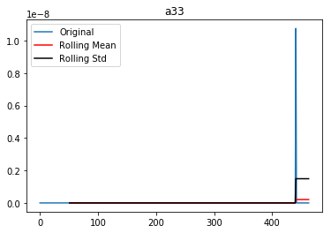


    Results of Dickey-Fuller Test:
    Test Statistic                 -21.517435
    p-value                          0.000000
    #Lags Used                       0.000000
    Number of Observations Used    463.000000
    Critical Value (1%)             -3.444553
    Critical Value (5%)             -2.867803
    Critical Value (10%)            -2.570106
    dtype: float64
    


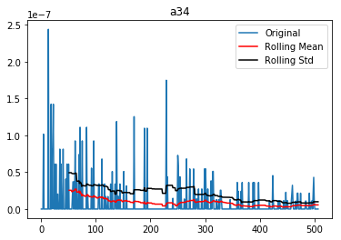


    Results of Dickey-Fuller Test:
    Test Statistic                -1.468685e+01
    p-value                        3.093388e-27
    #Lags Used                     1.000000e+00
    Number of Observations Used    5.060000e+02
    Critical Value (1%)           -3.443340e+00
    Critical Value (5%)           -2.867269e+00
    Critical Value (10%)          -2.569821e+00
    dtype: float64
    


    Results of Dickey-Fuller Test:
    Test Statistic                  -3.809081
    p-value                          0.002816
    #Lags Used                      11.000000
    Number of Observations Used    445.000000
    Critical Value (1%)             -3.445131
    Critical Value (5%)             -2.868057
    Critical Value (10%)            -2.570241
    dtype: float64
    


    Results of Dickey-Fuller Test:
    Test Statistic                  -5.053787
    p-value                          0.000017
    #Lags Used                       4.000000
    Number of Observations Used    468.000000
    Critical Value (1%)             -3.444400
    Critical Value (5%)             -2.867736
    Critical Value (10%)            -2.570070
    dtype: float64
    


    Results of Dickey-Fuller Test:
    Test Statistic                 -20.908062
    p-value                          0.000000
    #Lags Used                       0.000000
    Number of Observations Used    449.000000
    Critical Value (1%)             -3.444998
    Critical Value (5%)             -2.867999
    Critical Value (10%)            -2.570210
    dtype: float64
    


    Results of Dickey-Fuller Test:
    Test Statistic                  -2.973026
    p-value                          0.037491
    #Lags Used                      11.000000
    Number of Observations Used    447.000000
    Critical Value (1%)             -3.445064
    Critical Value (5%)             -2.868028
    Critical Value (10%)            -2.570226
    dtype: float64
    


    Results of Dickey-Fuller Test:
    Test Statistic                  -5.304842
    p-value                          0.000005
    #Lags Used                      12.000000
    Number of Observations Used    488.000000
    Critical Value (1%)             -3.443821
    Critical Value (5%)             -2.867481
    Critical Value (10%)            -2.569934
    dtype: float64
    


    Results of Dickey-Fuller Test:
    Test Statistic                -6.501620e+00
    p-value                        1.158034e-08
    #Lags Used                     9.000000e+00
    Number of Observations Used    4.630000e+02
    Critical Value (1%)           -3.444553e+00
    Critical Value (5%)           -2.867803e+00
    Critical Value (10%)          -2.570106e+00
    dtype: float64
    


    Results of Dickey-Fuller Test:
    Test Statistic                  -1.996208
    p-value                          0.288238
    #Lags Used                      11.000000
    Number of Observations Used    433.000000
    Critical Value (1%)             -3.445543
    Critical Value (5%)             -2.868238
    Critical Value (10%)            -2.570338
    dtype: float64
    


    Results of Dickey-Fuller Test:
    Test Statistic                  -3.403355
    p-value                          0.010845
    #Lags Used                       8.000000
    Number of Observations Used    376.000000
    Critical Value (1%)             -3.447862
    Critical Value (5%)             -2.869258
    Critical Value (10%)            -2.570881
    dtype: float64
    


    Results of Dickey-Fuller Test:
    Test Statistic                  -3.818212
    p-value                          0.002726
    #Lags Used                       6.000000
    Number of Observations Used    433.000000
    Critical Value (1%)             -3.445543
    Critical Value (5%)             -2.868238
    Critical Value (10%)            -2.570338
    dtype: float64
    


    Results of Dickey-Fuller Test:
    Test Statistic                -9.927614e+00
    p-value                        2.878961e-17
    #Lags Used                     1.000000e+00
    Number of Observations Used    3.980000e+02
    Critical Value (1%)           -3.446888e+00
    Critical Value (5%)           -2.868829e+00
    Critical Value (10%)          -2.570653e+00
    dtype: float64
    


    Results of Dickey-Fuller Test:
    Test Statistic                -7.628780e+00
    p-value                        2.034981e-11
    #Lags Used                     2.000000e+00
    Number of Observations Used    4.000000e+02
    Critical Value (1%)           -3.446804e+00
    Critical Value (5%)           -2.868793e+00
    Critical Value (10%)          -2.570634e+00
    dtype: float64
    


    Results of Dickey-Fuller Test:
    Test Statistic                  -1.383949
    p-value                          0.589947
    #Lags Used                      14.000000
    Number of Observations Used    408.000000
    Critical Value (1%)             -3.446480
    Critical Value (5%)             -2.868650
    Critical Value (10%)            -2.570557
    dtype: float64
    


    Results of Dickey-Fuller Test:
    Test Statistic                -6.469065e+00
    p-value                        1.381678e-08
    #Lags Used                     1.000000e+00
    Number of Observations Used    3.080000e+02
    Critical Value (1%)           -3.451761e+00
    Critical Value (5%)           -2.870970e+00
    Critical Value (10%)          -2.571794e+00
    dtype: float64
    


    Results of Dickey-Fuller Test:
    Test Statistic                -1.049502e+01
    p-value                        1.121338e-18
    #Lags Used                     1.000000e+00
    Number of Observations Used    4.900000e+02
    Critical Value (1%)           -3.443766e+00
    Critical Value (5%)           -2.867457e+00
    Critical Value (10%)          -2.569921e+00
    dtype: float64
    


    Results of Dickey-Fuller Test:
    Test Statistic                  -3.050080
    p-value                          0.030475
    #Lags Used                       8.000000
    Number of Observations Used    471.000000
    Critical Value (1%)             -3.444310
    Critical Value (5%)             -2.867696
    Critical Value (10%)            -2.570049
    dtype: float64
    


    Results of Dickey-Fuller Test:
    Test Statistic                  -4.194474
    p-value                          0.000673
    #Lags Used                       8.000000
    Number of Observations Used    435.000000
    Critical Value (1%)             -3.445473
    Critical Value (5%)             -2.868207
    Critical Value (10%)            -2.570321
    dtype: float64
    


    Results of Dickey-Fuller Test:
    Test Statistic                  -5.300617
    p-value                          0.000005
    #Lags Used                      17.000000
    Number of Observations Used    448.000000
    Critical Value (1%)             -3.445031
    Critical Value (5%)             -2.868013
    Critical Value (10%)            -2.570218
    dtype: float64
    


    Results of Dickey-Fuller Test:
    Test Statistic                  -5.196448
    p-value                          0.000009
    #Lags Used                       0.000000
    Number of Observations Used    422.000000
    Critical Value (1%)             -3.445941
    Critical Value (5%)             -2.868413
    Critical Value (10%)            -2.570431
    dtype: float64
    


    Results of Dickey-Fuller Test:
    Test Statistic                -6.052569e+00
    p-value                        1.267267e-07
    #Lags Used                     1.300000e+01
    Number of Observations Used    4.740000e+02
    Critical Value (1%)           -3.444221e+00
    Critical Value (5%)           -2.867657e+00
    Critical Value (10%)          -2.570028e+00
    dtype: float64
    


    Results of Dickey-Fuller Test:
    Test Statistic                -1.053776e+01
    p-value                        8.810400e-19
    #Lags Used                     2.000000e+00
    Number of Observations Used    4.370000e+02
    Critical Value (1%)           -3.445403e+00
    Critical Value (5%)           -2.868177e+00
    Critical Value (10%)          -2.570305e+00
    dtype: float64
    


    Results of Dickey-Fuller Test:
    Test Statistic                  -5.316712
    p-value                          0.000005
    #Lags Used                      14.000000
    Number of Observations Used    451.000000
    Critical Value (1%)             -3.444933
    Critical Value (5%)             -2.867970
    Critical Value (10%)            -2.570195
    dtype: float64
    


    Results of Dickey-Fuller Test:
    Test Statistic                  -4.113528
    p-value                          0.000920
    #Lags Used                       4.000000
    Number of Observations Used    269.000000
    Critical Value (1%)             -3.454896
    Critical Value (5%)             -2.872345
    Critical Value (10%)            -2.572528
    dtype: float64
    


    Results of Dickey-Fuller Test:
    Test Statistic                  -4.874372
    p-value                          0.000039
    #Lags Used                      11.000000
    Number of Observations Used    452.000000
    Critical Value (1%)             -3.444900
    Critical Value (5%)             -2.867956
    Critical Value (10%)            -2.570187
    dtype: float64
    


    Results of Dickey-Fuller Test:
    Test Statistic                  -5.375052
    p-value                          0.000004
    #Lags Used                       8.000000
    Number of Observations Used    474.000000
    Critical Value (1%)             -3.444221
    Critical Value (5%)             -2.867657
    Critical Value (10%)            -2.570028
    dtype: float64
    


    Results of Dickey-Fuller Test:
    Test Statistic                  -5.342202
    p-value                          0.000004
    #Lags Used                       5.000000
    Number of Observations Used    458.000000
    Critical Value (1%)             -3.444709
    Critical Value (5%)             -2.867871
    Critical Value (10%)            -2.570142
    dtype: float64
    


    Results of Dickey-Fuller Test:
    Test Statistic                  -1.813468
    p-value                          0.373796
    #Lags Used                       2.000000
    Number of Observations Used    452.000000
    Critical Value (1%)             -3.444900
    Critical Value (5%)             -2.867956
    Critical Value (10%)            -2.570187
    dtype: float64
    


    Results of Dickey-Fuller Test:
    Test Statistic                -6.673468e+00
    p-value                        4.526341e-09
    #Lags Used                     1.100000e+01
    Number of Observations Used    4.420000e+02
    Critical Value (1%)           -3.445232e+00
    Critical Value (5%)           -2.868101e+00
    Critical Value (10%)          -2.570265e+00
    dtype: float64
    


    Results of Dickey-Fuller Test:
    Test Statistic                -6.644475e+00
    p-value                        5.308127e-09
    #Lags Used                     2.000000e+00
    Number of Observations Used    4.030000e+02
    Critical Value (1%)           -3.446681e+00
    Critical Value (5%)           -2.868739e+00
    Critical Value (10%)          -2.570605e+00
    dtype: float64
    

Por ello es posible pronosticarlas con el método de Holt-Winter


```python
# https://www.analyticsvidhya.com/blog/2018/02/time-series-forecasting-methods/
# https://machinelearningmastery.com/time-series-forecasting-methods-in-python-cheat-sheet/
# https://towardsdatascience.com/time-series-in-python-exponential-smoothing-and-arima-processes-2c67f2a52788

from statsmodels.tsa.api import Holt, SimpleExpSmoothing, ExponentialSmoothing

pronosticos = []
real = []
for i in range(len(ciesTS)):
    temp = ciesTS.iloc[i, : 508]
    temp.dropna(inplace=True)
    
    # https://medium.com/datadriveninvestor/how-to-build-exponential-smoothing-models-using-python-simple-exponential-smoothing-holt-and-da371189e1a1
    # Train = 0.7
    train = round(0.7 * len(temp))
    f = ExponentialSmoothing(np.asarray(temp.iloc[0:train])).fit(smoothing_level = 0.1)
    # https://stackoverflow.com/a/50786171
    pred = f.predict(start=train + 1, end=len(temp))
    fcast = f.forecast(len(temp) - train)
    plt.figure(figsize=(12, 4))
    plt.plot(temp)
    plt.plot(f.fittedvalues, c='black')
    plt.plot(range(train, len(temp)), fcast, c='red')
    #plt.plot(range(train, len(temp)), pred, c='red')
    plt.title(ciesTS.iloc[i, 508])
    plt.legend(["Serie de tiempo", "Ajuste de Holt-Winter", "Pronóstico de Holt-Winter"])
    plt.show()
    
    
    # https://stackoverflow.com/a/15863028
    real.append(temp.iloc[-1])
    pronosticos.append(fcast[0])
```


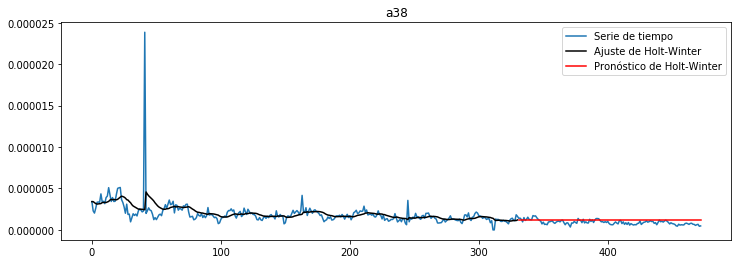


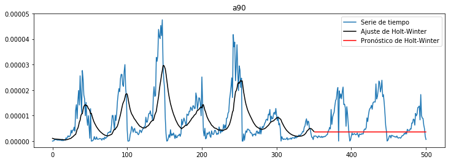


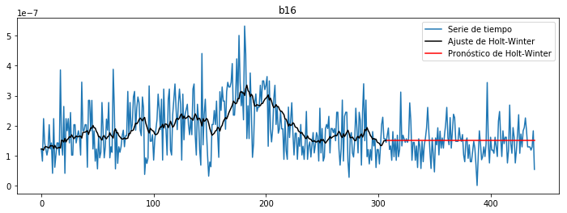


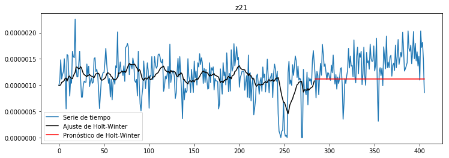


Que presenta muy buen ajuste respecto a los datos reales


```python
a, b, r, p, e = stats.linregress(real, pronosticos)
print("y = f(x) = {:.4f} x + {:.4f}".format(a, b))
print("error", e)
print("p = ", p)
print("pendiente {:s}significativa".format("no " if p >= 0.05 else ""))
print("R^2", r**2)

plt.title('Logaritmo del pronóstico', fontsize = 20)
plt.xlabel('Logaritmo del último caso normalizado')
plt.ylabel('Pronóstico')
plt.scatter(real, pronosticos)
plt.show()
```

    y = f(x) = 1.1122 x + 0.0000
    error 0.019116083562680818
    p =  5.559074078899032e-38
    pendiente significativa
    R^2 0.9891871972161727
    


Lo que se evidencia claramente al utilizar escala logarítmica en los datos


```python
plt.title('Logaritmo del pronóstico', fontsize = 20)
plt.xlabel('Logaritmo del último caso normalizado')
plt.ylabel('Pronóstico')
plt.scatter(np.log(real), np.log(pronosticos))
plt.show()
```

    C:\Users\bena8\AppData\Local\Programs\Python\Python37-32\lib\site-packages\ipykernel_launcher.py:4: RuntimeWarning: divide by zero encountered in log
      after removing the cwd from sys.path.
    


```python
# https://machinelearningmastery.com/time-series-forecast-uncertainty-using-confidence-intervals-python/
# https://machinelearningmastery.com/make-sample-forecasts-arima-python/
from statsmodels.tsa.arima_model import ARIMA

def difference(dataset, interval=1):
    diff = list()
    for i in range(interval, len(dataset)):
        value = dataset[i] - dataset[i - interval]
        diff.append(value)
    return pd.Series(diff)

for i in range(len(ciesTS)):
    temp = ciesTS.iloc[i, : 508]
    temp.dropna(inplace=True)
    train = round(0.9 * len(temp))
    ts = difference(np.asarray(temp), interval=len(temp) - train - 1)
    m = ARIMA(ts, order=(3, 1, 0))  
    f = m.fit(trend = 'nc', disp = 0)
    pred = f.predict(start=train + 1, end=len(temp))
    tempDiff = temp - temp.shift()
    plt.figure(figsize=(16, 4))
    plt.plot(tempDiff)
    plt.plot(f.fittedvalues, color='red')
    plt.plot(range(train, len(temp)), pred, c='black')
    plt.legend(['Diferencia', 'Valores ajustados de ARIMA', 'Pronóstico de ARIMA'])
    plt.show()
```


